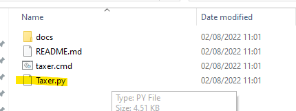

# Eve-Moon-Taxer
This is tool for our corp members to calculate mined moon ore tax.

## Installation
Install python3 [link](https://www.python.org/downloads/). During installation you will be asked to add path variable - check that field.

If for some reason you still have no environment variable set follow [this link](docs/PythonEnvVar.md).

## Rules
- Only compressed ore!
- Only one contract per player!

## How to download
- Go to the top of current page
- Click Code > Download ZIP

- Unpack zip
- Open app via taxer.cmd shortcut

## How it works
- In eve inventory select all COMPRESSED moon ore, copy to clipboard(ctrl+c)
- Open Moon Taxer app (taxer.cmd)
- Enter all your miner character names
- Click submit
- Parsed message will be copied to your clipboard
- Contact moon officer, paste copied message