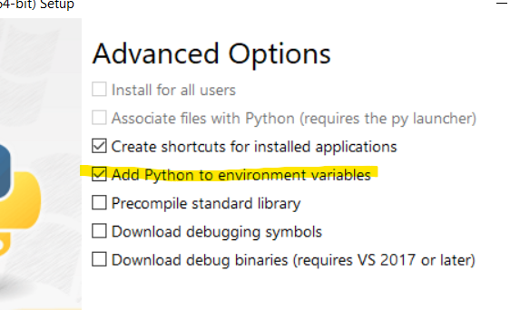
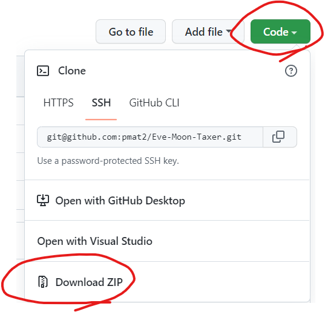
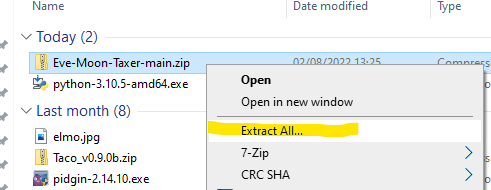
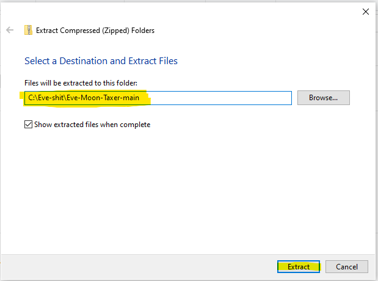
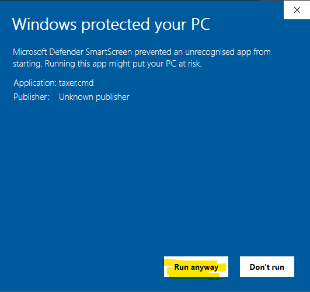

# Eve-Moon-Taxer
This is tool for our corp members to calculate mined moon ore tax.

## Installation
Install python3 [link](https://www.python.org/downloads/). During installation you will be asked to add path variable - check that field.

If for some reason you still have no environment variable set follow [this link](docs/PythonEnvVar.md).

## Rules
- Only compressed ore!
- Only one contract per player!

## How to download
- Go to the top of current page
- Click Code > Download ZIP

- Unpack zip

- Chose destination

- Go to given directory

- Open app via taxer.cmd shortcut

## App GUI

- 1. Character field
- 2. Add character button
- 3. Clear characters button
- 4. Characters list
- 5. Submit button

## How it works
- In Eve Online open inventory with mined ore.
- Select all mined ore(you can just ctrl+a, program knows which is moon ore and which not)
- Open Moon Taxer app (taxer.cmd)
- Enter all your miner character names. Type their names into 'Character field' (1), then press 'Add character button' (2). Characters will be added to 'Characters list' (4).
- If for any reason you made a typo in character name you can clear list with 'Clear characters button' (3).
- Click 'Submit button'(5).
- Window will pop up.

- At this point parsed message is copied to your clipboard.
- Contact moon officer, paste copied message.
- Done!